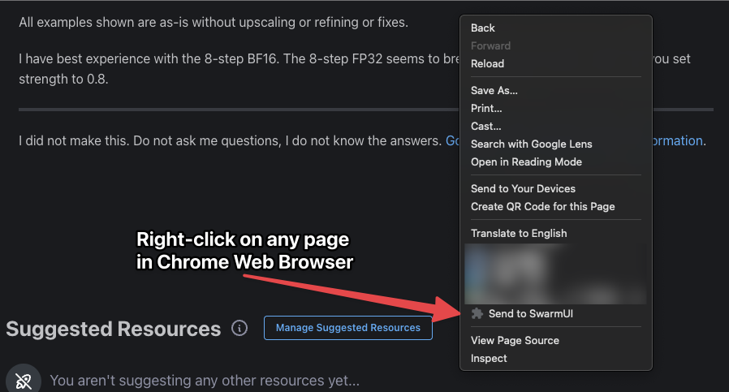
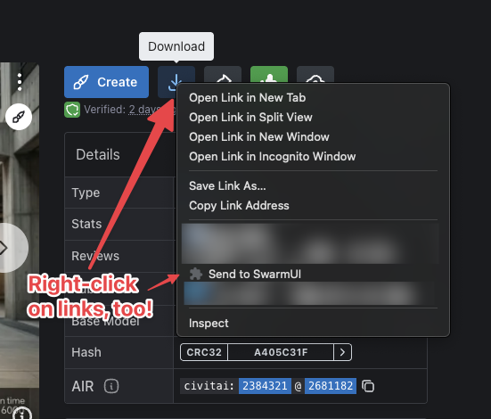
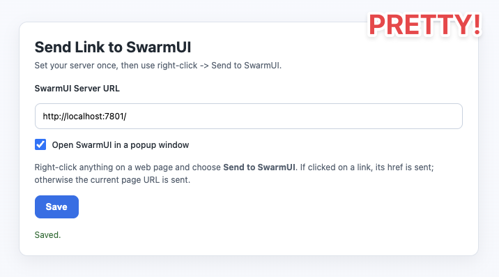

# SwarmUI DownloaderHelper

SwarmUI and Chrome extension for sending links straight into SwarmUI's Model Downloader page.

Right-click a page or link, choose **Send to SwarmUI**, and it forwards the URL into your SwarmUI tab.

## Quick Use

* Clone this repo to your local computer
* Open [chrome://extensions/](chrome://extensions/) in Chrome
* Make sure "Developer mode" is toggled ON at the top-right of screen
* Click the "Load unpacked" button at top-left of screen
* Select the [Assets/Chrome](Assets/Chrome) directory (official Chrome Store extension coming soon)
* On first install, the settings page opens so you can enter your SwarmUI server URL. Requires full protocol, like `http://localhost:7801`
* Keep popup mode on if you want SwarmUI in its own window
* Right-click any page or model link and choose **Send to SwarmUI**

